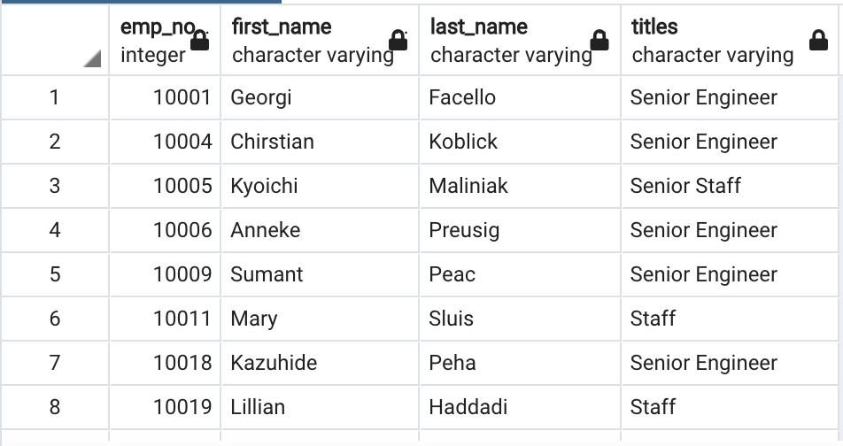
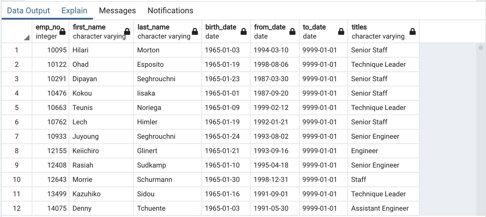
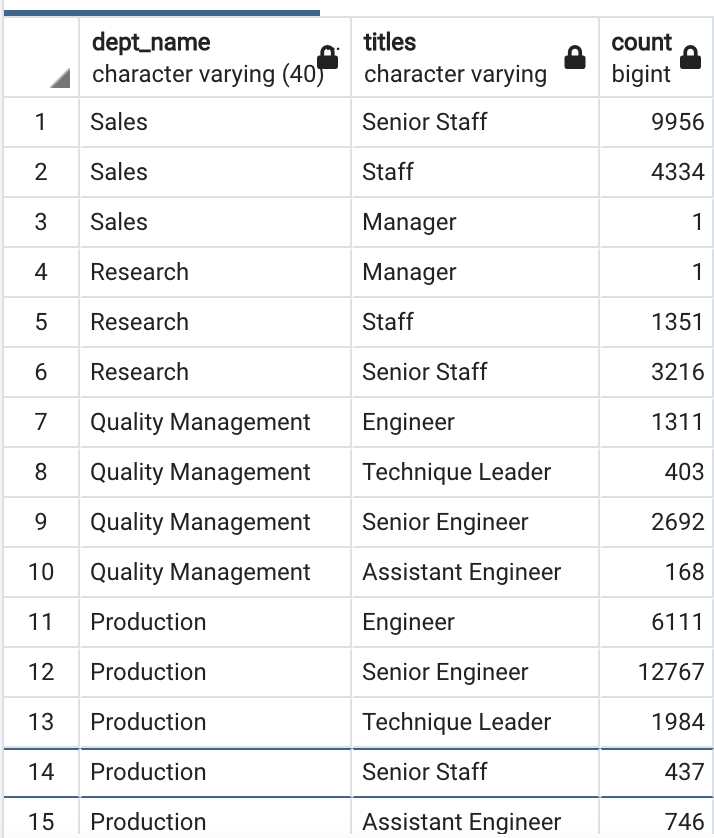
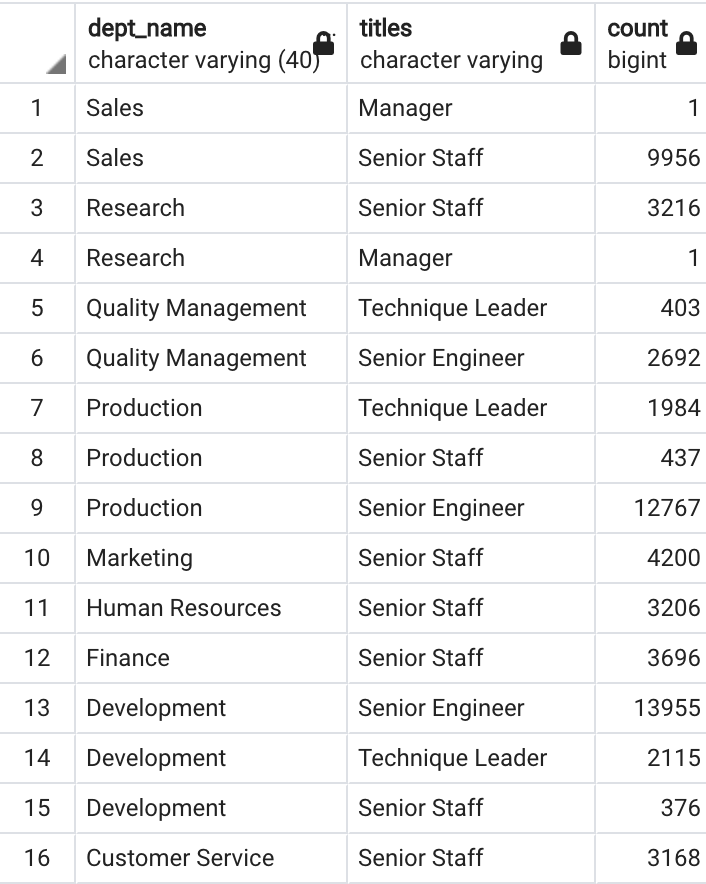

# Pewlett_Hackard_Analysis

## Purpose
The purpose of this project is to helps prepare Pewlett-Hackard for the “silver tsunami” as many current employees reach retirement age. This analysis focuses on: 
  1. Identifying the retiring employees by their title.
  2. Determing the sum of retiring employees grouped by title.
  3. Identifying the employees eligible for participation in the mentorship program.
  4. Followed by creating a report that summarizes this analysis.

## Resources
Data Source:
-	[Six csv files](Data/)

Software:
-	PostreSQL
-	pgAdmin 4
-	Quick DBD

## Results
### 1. The list of retiring employees

- The table includes employee number, first name, last name, title, from-date and to-date.
- The query returns 133,776 rows.
- The table displays a list of employees who are going to retire in the next few years.
- The list is very extensive, bu the snapshot below gives us some insights about the query. Some employees appear more than once due to change of title      during their career at Pewlett-Hackard.

### 2. The list of retiring employees without duplicates

- The table includes employee number, first name, last name, title, from-date and to-date.
- The query returns 90,398 rows.
- The table displays a list of employees who are going to retire in the next few years.
- In the table each employee is listed only once, by her or his most recent title.

### 3. The number of employees by their most recent job title who are about to retire.
- The table includes employees' titles and their sum. 
- The query returns 7 rows.
- This table allows us to see how many employees will retire within the next few years within their most recent job title. 

### 4. Employees eligible for the mentorship program
- This table contains information such as employee number, first and last name, birth date, from and to date and title. 
- The output data provides a list of employees who is eligible for the mentorship program. 

## Summary
### How many roles will need to be filled as the "silver tsunami" begins to make an impact?
- The table retirement titles contains all the information about the employees that are about to retire in the next four years. To get the number of positions that will be open in next four years I ran additional query that breaks down how many staff will retire per department. Since every department will be affected in some way this query gives more precise numbers what each department can expect and how many roles will need to be filled. Most positions that will be affected are engineering roles. 

### Are there enough qualified, retirement-ready employees in the departments to mentor the next generation of Pewlett Hackard employees?
- To ensure that are enough qualified staff for training at Pewlett-Hackard I ran a query with additional filter that returns only employees on higher positions, assuming that these positions are the ones qualified to mentor. From the table we can see how many qualified employees are in each department to train next generation of employees. 

